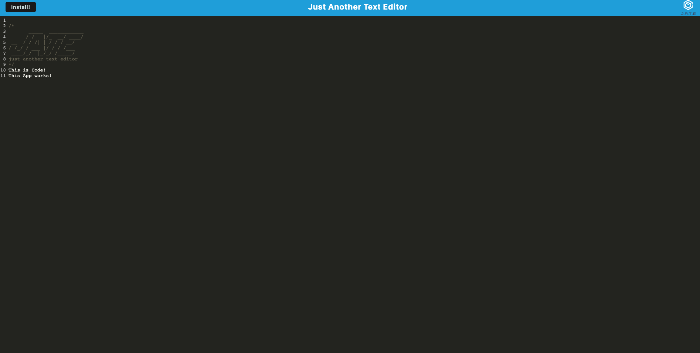

# Text-Editor-io

## Description 
This is a application that allows the user to code to their browser and have their code automatically save and reload when the user leaves the app. This application also allows installation on devices to give the user the ability to use the app offline. 

Deployed App: https://murmuring-depths-08823.herokuapp.com/

## Installation
This application requires the user to have installed Node.js. The user will also have to install all of the necessary packages that will be mentioned in the Technology section. The package.json within the root, client, and server files will have to have all of the required packages in order to make the application to run. 

## Usage 
This application can be run with http://localhost:3000 or by installing the app in your devise. 

## Technology 
Node.js

IDB

Babel

Webpack 

Express 

Workbox

## Author 
Oscar Silva 

GitHub: https://github.com/Ozz760

Email: oscarsilva2356@gmail.com 